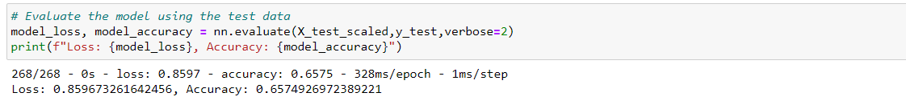

# Neural_Network_Charity_Analysis

## Overview of the analysis
The purpose of this analysis is to create a binary classifier that is capable of predicting wheteher applicants would be successfull if founded by Alphabet Soup.
This project consists of three technical analysis deliverables and a written report. 
* Deliverable 1: Preprocessing Data for a Neural Network Model
* Deliverable 2: Compile, Train, and Evaluate the Model
* Deliverable 3: Optimize the Model
* Deliverable 4: A Written Report on the Neural Network Model (README.md)

## Results
The original model performed with an acurracy of 63% and a loss value of 0.80. In the optimization part which corresponds to Deliverable 3 I made three attempts to optimize the model and try to obtain an accurracy of 75%. These models are described in more detail in the next section:

### Model 1- Increase number of epochs in training regimen

Data Preprocessing
* What variable(s) are considered the target(s) for your model? IS_SUCCESSFUL column
* What variable(s) are considered to be the features for your model? everything except the target variable
* What variable(s) are neither targets nor features, and should be removed from the input data?  ID columns, 'EIN' and 'NAME'.

Compiling, Training, and Evaluating the Model
* How many neurons, layers, and activation functions did you select for your neural network model, and why? The number of neurons was kept the same, it includes 2 layers; the first one with 80 hidden nodes and the second with 30 hidden nodes. The activation function chosen was sigmoid.
* Were you able to achieve the target model performance? No, the accuracy of the model did not meet the goal of 75%. However the accurracy increased to 66%.
* What steps did you take to try and increase model performance? I increased the number of epochs in the training regimen to 150 instead of 100.

### Model 2- Adding more neurons to hidden layer

Data Preprocessing
* What variable(s) are considered the target(s) for your model? IS_SUCCESSFUL column
* What variable(s) are considered to be the features for your model? everything except the target variable
* What variable(s) are neither targets nor features, and should be removed from the input data?  ID columns, 'EIN' and 'NAME'.

Compiling, Training, and Evaluating the Model
* How many neurons, layers, and activation functions did you select for your neural network model, and why? The model includes 2 layers; the first one with 100 hidden nodes and the second with 50 hidden nodes. The activation function chosen was sigmoid.
* Were you able to achieve the target model performance? No, the accuracy of the model did not meet the goal of 75%. And the accuracy decreased to 60%.
* What steps did you take to try and increase model performance? I add more neurons to the hidden layer

### Model 3- Remove unnecessary input columns

Data Preprocessing
* What variable(s) are considered the target(s) for your model? IS_SUCCESSFUL column
* What variable(s) are considered to be the features for your model? everything except the target variable
* What variable(s) are neither targets nor features, and should be removed from the input data?  ID columns, 'EIN' and 'NAME', 'SPECIAL_CONSIDERATIONS'

Compiling, Training, and Evaluating the Model
* How many neurons, layers, and activation functions did you select for your neural network model, and why? The model includes 2 layers; the first one with 80 hidden nodes and the second with 30 hidden nodes. The activation function chosen was sigmoid.
* Were you able to achieve the target model performance? No, the accuracy of the model did not meet the goal of 75%. However the accuracy increased to 69%.
* What steps did you take to try and increase model performance? I remove unnecessary input columns ('SPECIAL_CONSIDERATIONS')

Summary: The first binary classifier model did a decent job at predicting wheteher applicants would be successfull if founded by Alphabet Soup with a 63% accuracy. By making changes and optimizing the model I was able to improve the accuracy of the model to 69% by removing unecessary input columns and obtained an accuracy of 66% by increasing the number of epochs in the training regimen. However when I tested the model with a higher number of neurons in the hidden layers the model did not improve its accuracy. Based on the results, my recommendation would be to implement a model that focused on removing unnecessary input columns or a model that increases the number of epochs in the training regimen, and maybe even combine these two changes into one mdel and test how it performs. 
Eventhough any og the models meet the target accuracy of 75%, there are still other methods that can be tested to optimize the model, such as adding an additional hidden layer or use a different activation fucntion. 

